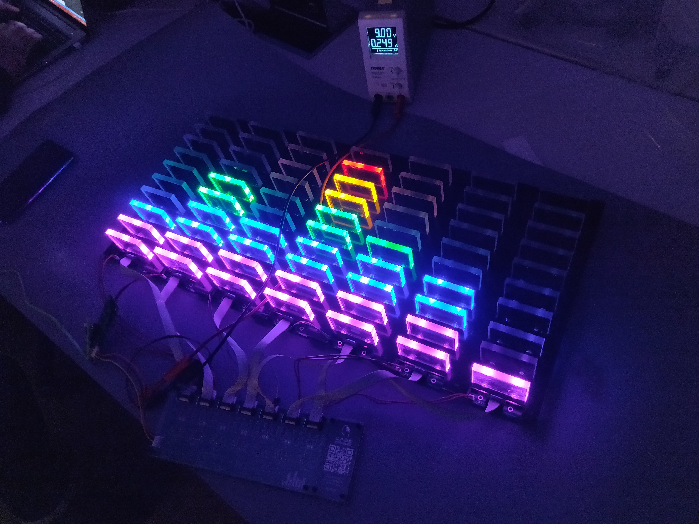
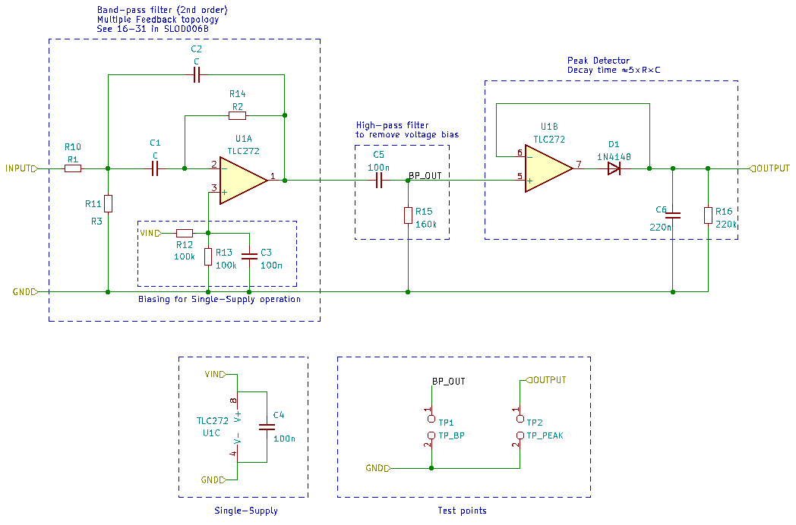
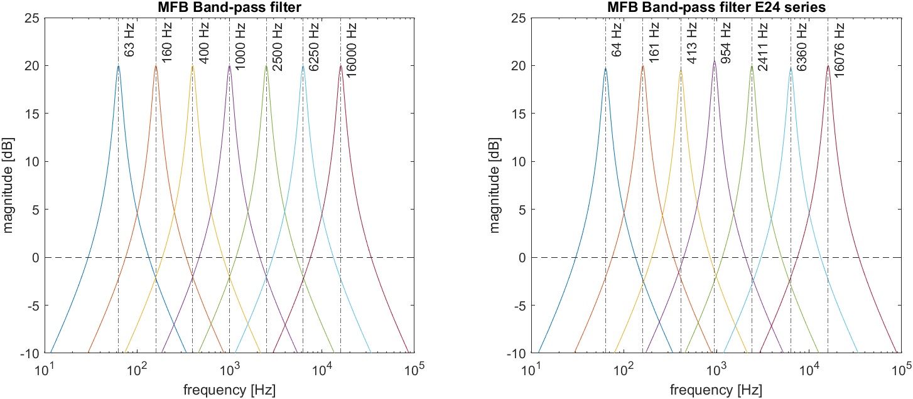
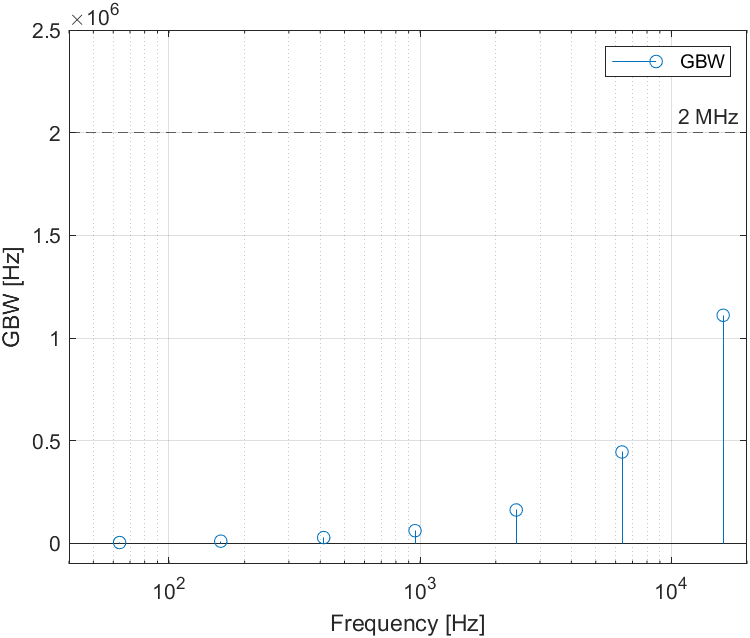

# Sonus7
  Sonus7 is an analog seven-band spectrum bargraph with op amps. It consists of seven VU-meters, each being fed with a bandpass filter and peak detector circuit. 
  
  Each band has a spacing of 1.25 octaves. The bands are: 63 Hz, 160 Hz, 400 Hz, 1.25 kHz, 2.5 kHz, 6.25 kHz, 16 kHz. 
  
  The filters are second-order Multiple Feedback bandpass filters using TLC272 opamps. The VU-meters consist of a logaritmic comparator array, also using TLC272 opamps. The project is inspired by a reel of 2000 TLC272 bought cheaply at an auction.
  
# Features
- Fully analog
- Seven frequency bands
- 10 levels per band
- 1.25 octave spacing
- 63 Hz to 16 kHz frequency range

# Filters
The filters were chosen to be Multiple Feedback filters since they allow independent adjustment of the gain $A_m$, filter quality $Q$ and mid frequency $f_m$. The transfer function and equations for calculating component values are taken from TI's design reference SLOD006B (16-31).

The gain and filter quality were set to $A_m = -10, \: Q = 6$ while capacitor values were chosen in the range of 33 to 0.33 nF to end up with reasonable resistor values. A MATLAB script is provided to calculate the exact resistor values and then round to nearest corresponding value from the E-24 series. The frequency responses are then simulated for the exact and rounded resistor values.

A final calculation is done to ensure the filter gains do not exceed the unity gain bandwidth (GBW) of the op amps. The actual amplification from the op amps is obtained from the noise gain. The noise gain is then multiplied with the corresponding mid frequency of each filter to obtain the (highest) GBW. This is also provided in the same MATLAB script. The calculation shows that all filters have a GBW below 2 MHz (TLC272), although the 16 kHz filter is close at 1.1 MHz. Thus, variations in temperature or other factors might limit the gain for 16 kHz filter.

The filtered signals are fed into peak detectors to obtain the audio level for each. The audio levels are then fed into the comparators which control the LEDs.

# Comparators
The comparators are built from open loop op amps. Reference voltage levels are generated from a logarithmic resistor ladder (3 dB per step) and fed into the non-inverting inputs. The inverting input is fed with the audio level. The op amp output can now function as a current sink for the LEDs. Any time the audio level exceeds the reference voltage level, the output is pulled low, allowing current flow for that level. Each op-amp drives one level, resulting in 70 op amps in total for the comparator stage.

# Construction

## PCBs
The Sonus7 consists of three boards (types).
### Input Stage
 The input stage consists of a custom board with an ESP32 and PCM5100. The ESP32 recieves the audio wirelessly through snapcast, using the port by . The audio data is then sent to the PCM5100 DAC over I2S. The input stage is connected to the next stage using a 4pin JST EH connector (VCC, GND, MONO, GND). The Kicad files for the input stage are available in /PCBs/ESP-input/.

### Filter and Comparator stage
The filter and comparator stage is the main board and contains all the filters and the comparator arrays. This board also contains the input power DC-jack (9V) along with a simple reverse input protection (PMOS) and thus powers the rest of the boards.

### LED bar
The final stage are the display boards. These are very simple boards with only LEDs, resistors and connectors on them. There is a small cutout on each level for the acrylic diffusers. There are seven of these boards, each one is connected to the main board using an ribbon cable (10p IDC) and a 2p JST cable (9V + GND).

## Mechanical

# Improvements
## Less cables
There is currently a 10p IDC for signal and a 2p JST for power. Combining power and signal into one connector (12p IDC) would tidy up the design.

## More stable supply voltage
Due to varying current draw (LEDs), the Drain-Source resistance of the PMOS causes to a varying voltage drop of 0-22 mV ($R_{DS}$ = 32 mOhm, $I_{DS}$ = 0.7 A). This can cause issues for the op amps, which need a stable supply voltage. A simple fix could be adding a power regulator after the reverse input protection.

## GBW
The 16 kHz filter is quite close to the rated GBW of the TLC272. There is only a margin of $\frac{2}{1.1} \approx 1.8$ in gain before the limit. This can be solved by using cascaded filters which results in the individual gain of each op amp being smaller. Replacing the TLC272 with higher bandwidth op amps also works.

## Variable brightness
Currently the brightness of the LEDs are set by series resistors. Some brightness control using PWM or some other method could be good for the next version.
 

# Bill of Materials

# Contributors
**Daniel Quach** ([Muoshy](https://github.com/Muoshy))  
Main Contributor
- Filter design & Simulations
- PCB Design and assembly

**Johan Wheeler** ([johanwheeler](https://github.com/johanwheeler))
- Mechanical design
- Mechanical assembly

**Adam Anderson** ([adand00](https://github.com/adaand00))
- ESP input stage
- PCB Design and programming
